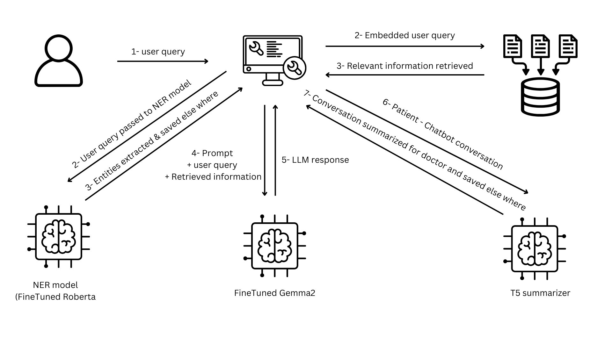

# Medical AI Assistant

This project implements a Medical AI Assistant using a combination of Natural Language Processing (NLP) techniques and deep learning models. The assistant is designed to answer medical-related questions based on user input and a context-aware retrieval system. The core functionalities include Named Entity Recognition (NER), Retrieval-Augmented Generation (RAG), and summarization.

## Project Overview

The assistant leverages several pre-trained and fine-tuned models, including:

- **RoBERTa NER Model**: A fine-tuned version of RoBERTa Large for detecting medical entities such as age, height, and weight.
- **Gemma-2 Model**: A fine-tuned Gemma-2 language model, using QLoRA (4-bit quantization with LoRA parameters) for efficient inference.
- **T5-Large Model**: A summarization model used to generate concise summaries of the conversation between the user and the assistant.



## Features

- **Named Entity Recognition (NER)**: Detects and extracts medical entities such as age, height, and weight from the user input.
- **Retrieval-Augmented Generation (RAG)**: Searches a FAISS-based index of medical documents to provide relevant context for answering user queries.
- **Summarization**: Provides a summary of the interaction, focusing on the key points discussed.

## Project Structure

- **Data Loading and Indexing**:

  - The project uses `PyPDFDirectoryLoader` to load documents from a specified directory.
  - Documents are split into manageable chunks using `RecursiveCharacterTextSplitter` and indexed using FAISS with embeddings generated by the `HuggingFaceEmbeddings` model.

- **NER Model**:

  - The NER model is based on `RobertaForTokenClassification`, fine-tuned on a custom dataset of around 1000 samples.
  - The model is designed to recognize entities like weight, height, and age.

- **Language Models**:
  - The assistant uses a fine-tuned Gemma-2 model, implemented with 4-bit quantization for efficient performance on GPUs.
  - The T5-Large model is used for summarization of interactions.

## Installation

### Prerequisites

- Python 3.8 or higher
- PyTorch
- Hugging Face Transformers
- LangChain
- FAISS
- PEFT
- Hugging Face Hub

### Clone the repository

```bash
git clone https://github.com/yourusername/medical-ai-assistant.git
cd medical-ai-assistant
```
